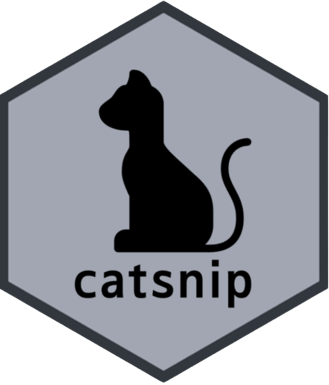

```{r, include = FALSE}
knitr::opts_chunk$set(
  collapse  = TRUE,
  comment   = "#>",
  fig.path  = "man/figures/README-",
  out.width = "100%"
)
library(magrittr)
library(knitr)
```

# <b>catsnip</b> 🐈<a href="https://github.com/csh01470/catsnip"></a>

<!-- badges: start -->
[](https://www.tidyverse.org/lifecycle/#experimental)
[](https://cran.r-project.org/package=catsnip)
[](https://github.com/csh01470/catsnip/actions/workflows/R-CMD-check.yaml)
<!-- badges: end -->

## Overview

`catsnip` is a package that wraps `catboost` models in `parsnip` format.

This package is based on `treesnip` package and provides following functions.

- Attach `catboost` model to `boost_tree()` function

- Install `catboost` package through `install_catboost()` function

- Avoid conflict between `bonsai` package and `catsnip` package during stacking model

## Documents

For a detailed explanation of `catboost` and `treesnip`, see links below.

- [Catboost](https://catboost.ai/docs/)

- [treesnip](https://curso-r.github.io/treesnip/)

## Installation

Since `catsnip` is not listed on CRAN, so use `install_github()` function.

``` r
devtools::install_github(repo="csh01470/catsnip")
```

You can also install `catboost` released version with,

``` r
catsnip::install_catboost() 
```

To install another version(ex: `0.16.5`), Use `version` parameter.

## Hyperparameters Map

```{r, echo=FALSE, warning=FALSE, message=FALSE}
tibble::tribble(
  ~ parsnip, ~catboost, 
  "mtry", "rsm",
  "trees", "iterations",
  "min_n", "min_data_in_leaf", 
  "tree_depth", "depth",
  "learn_rate", "learning_rate",
  "loss_reduction", "`???`",
  "sample_size", "subsample", 
  "stop_iter", "early_stopping_rounds"
) %>% 
  kable(escape = FALSE) 
```

## Package Roadmaps 

- [x] Support `GPU` processing

- [x] Optimization of parameters for `catboost` model and `boost_tree()` function

- [ ] Extract SHAP value by interworking with `fastshap` (or `shapviz`?) package 

## Code of Conduct

Please note that the `catsnip` project is released with a [Contributor Code of Conduct](https://contributor-covenant.org/version/2/0/CODE_OF_CONDUCT.html). 

By contributing to this project, you agree to abide by its terms.
